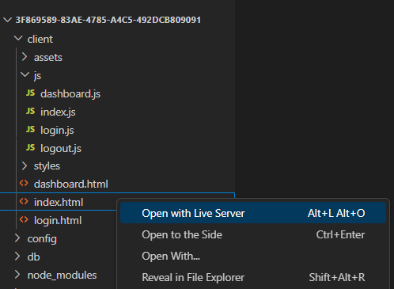
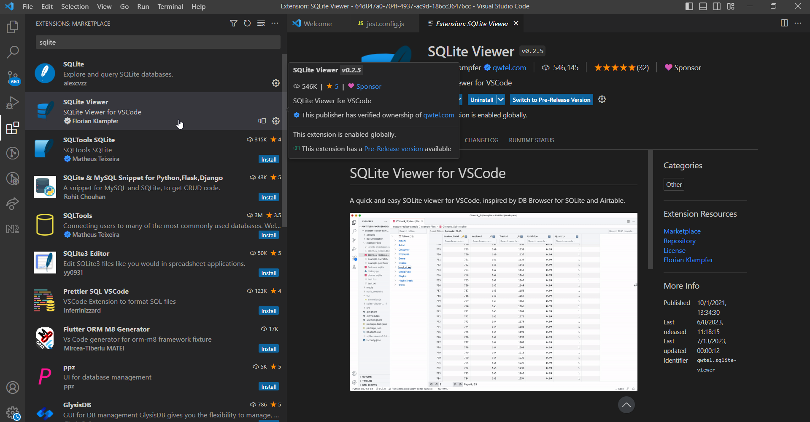

# Welcome to `DevQuest Test Run 2024`

>> DISCLAIMER: Please note that this project is created only for the purpose of DevQuest Test Run 2024 and does NOT represent best practices of software development. The project contains purposefully placed errors, bad design practices, bad code quality, and security malpractices.
>>

1. [Setting up your environment](#setting-up-your-environment)
2. [Solving the challenges](#solving-the-challenges)
3. [Getting support](#getting-support)
4. [References](#references)

## Setting up your environment

This section helps you to understand the prerequisite required and how to work with the codebase. Please read through carefully and follow the instructions to understand the codebase of this project.

### Prerequisites (Mandatory)

Installations of stable versions of `Git`, `Node.js` and `npm` are required on your computer. You must also be proficient in working with the aforementioned technologies.

[Install Git](https://git-scm.com/downloads)

[Install NodeJS 18.18.0](https://nodejs.org/en/blog/release/v18.18.0)

_Recommended: To ensure seamless management of multiple Node.js versions on your machine, it is highly recommended to use a **Node Version Manager (NVM)**._

> <p>
>      For Windows -: <a href="https://github.com/coreybutler/nvm-windows/releases/download/1.1.11/nvm-setup.exe" target="_blank">Download the .exe file</a>
> <br> 
>      Mac and Linux -: <a href="https://github.com/nvm-sh/nvm/blob/master/README.md#installing-and-updating" target="_blank">Refer this</a>

<br>

We recommend that you use [Visual Studio Code](https://code.visualstudio.com/download) and install the [Live Server](https://marketplace.visualstudio.com/items?itemName=ritwickdey.LiveServer) extension for a better developer experience.

### Clone the project to your local computer

Git repository URL and credentials will be available at the start of the contest through a link.

Use Git to clone the project to the local development environment using the credentials that will be shared with the team leader.

* `git clone <repository-url>`

> _Note for **Windows users**: Use `cmd` as the terminal to run commands._

### Installing dependencies

Once you clone the project from your team's Git repository, run the following command to install dependencies.

* `npm install`

### Validate if the environment is correctly setup

You can run the Sanity test file in the `tests` directory with the below command.

For Windows users,

* `npm test _sanity.test.js`

> _Note: If you get an error while running this command, make sure you have set all the prerequisites correctly on your machine._

<!-- If you have the environment correctly set up, all the tests should pass in the sanity test. If the sanity test fails with an internal , that is an indication of your environment setup issue, you must first attend to rectifying your development environment. -->

### Setting up the development database

Following commands will create a SQLite database called `main.sqlite3` in your root folder for development purposes. The `migrate` command deletes the existing database and creates a new one with the DB schema, whereas `seed` command populates the DB with some initial data. These steps are required for running the application.

* to recreate the database
  * `npm run migrate`
* to populate initial data
  * `npm run seed`

If you do change `db/seeds/**` files, the data base schema changes with `migrations` and it may cause to break your test cases and the application.
Therefore, ensure not to change or modify any files within the `db` and `tests` directories.

### Building and running the application

To start the server (without nodemon) use the following command:

* `npm start`

Click on the `index.html` file and click on the option **"Open with Live Server"** as shown in the screenshot below.

<p align="center">
  
</p>

### Add .gitignore

You will have to note that the project code has no `.gitignore` file. Please add a `.gitignore` file with the following content.

```
node_modules
config/node_modules
.env
.idea
package-lock.json
main.sqlite3
.vscode
junit.xml
```

> It is advised that one member of your team create the file, commit and push the .gitignore file to the remote repository with following commands.

### Commit and Push code to origin

* `git add .`
* `git commit -m "adding .gitignore file"`
* `git push`

Then other team members can pull the changes from the remote repository to receive the `.gitignore` file to their local machines.

* `git pull`

This is how you may use git to collaborate as a team in solving challenges.

### How to navigate in the application

The system you are about to develop is a platform specifically for connecting people with similar hobbies. Users can join communities, share tips and tricks, and collaborate on day-to-day activities related to their hobbies. The application consists of 3 main sub modules named,

1. **Hobby Scout** : This submodule revolutionizes the way users connect and collaborate based on their passions.  It offers personalized Friend Recommendations through a Hobby-Matching Algorithm, suggesting users who share necessary hobbies and streamlining team formation.

<br>

2. **Colab Hub** : This sub module enables users to create a virtual collaboration platform for hobbyists to work together on various activities using shared whiteboard, chat functionality, enabling team formation and goal-oriented projects.

<br>

3. **Project Mate** : Integrate activity management tools within the app to help users organize and track their hobby activities effectively. Users can create tasks, set deadlines, assign responsibilities, and track progress. This feature can enhance productivity and foster teamwork within the community.

<br>

You can use the following credentials to login as an already existing user in seed data. Navigate the application using the main menu.

* Username: `rhoward@office.com`
* Password: `Ryan@1234`

### Executing the Tests

Use below commands to run the tests. When you FIRST run, all the tests except `_sanity.test` will fail. This is expected.

* To run a single test file of a challenge:

  `npm test challenge0.test.js`

As you complete the challenges, respective tests will pass one by one. When you complete all the tasks of a challenge, all tests of the respective challenge should pass. Every DevQuest challenge has a test case which you can run to validate successful completion of the challenge.

> _Note: Tests are not using the main.sqlite3 database. Every test creates an isolated in-memory database._


### Legitimacy of your solution

Any attempt to compromise the integrity of the contest will `unconditionally disqualify` your team. Therefore please ensure you avoid attempting:

* Tampering files in the `tests` folder or `config` folder
* Hard coding values or logic to pass the test without solving the challenge legitimately

### Improving your developer Experience (Optional)

This step is not mandatory to work on the DevQuest challenges, but it may improve your development experience.

* Install a plugin for **SQLite Viewer** on your IDE so that you are able to explore the SQLite database.

<p align="center">
  
</p>

* Install any other plugin as necessary for you to improve your developer experience.

## Solving the challenges

If your sanity test pass and you are able to run the application, now you can proceed to the challenges. All the DevQuest challenges are documented in an own file. Please visit the links below, read carefully and get started solving them.

Although the challenges are independent from one another, it will be easier for you to solve them somewhat sequentially to understand the challenges better.

Note : We also have provided you with some challenges related to the features of the application that will not be evaluated for the competition.

Have fun!

You can now try out the [Challenge 0](./challenge-00.md) for the test run.

## Getting support

There will be minimal to no support available on the context day. We are not in a position to clarify challenge descriptions on individual basis. However in case of an setting up the project need, you may contact the technical support team via a chat on WhatsApp (No support for technical doubts) to the phone number `+94 71 382 6109`. If we answer a question, we may share your question (anonymously) and our answer, with all the team leaders via the common WhatsApp chat group where the team leaders will be added to in due course.

In case of **non-technical support** you may reach out to the DevQuest Support Contact No. `+94 76 777 4088` via calls only.

## References

* <a href="https://codefest.lk/devquest/" target="_blank">CodeFest DevQuest Website</a>
